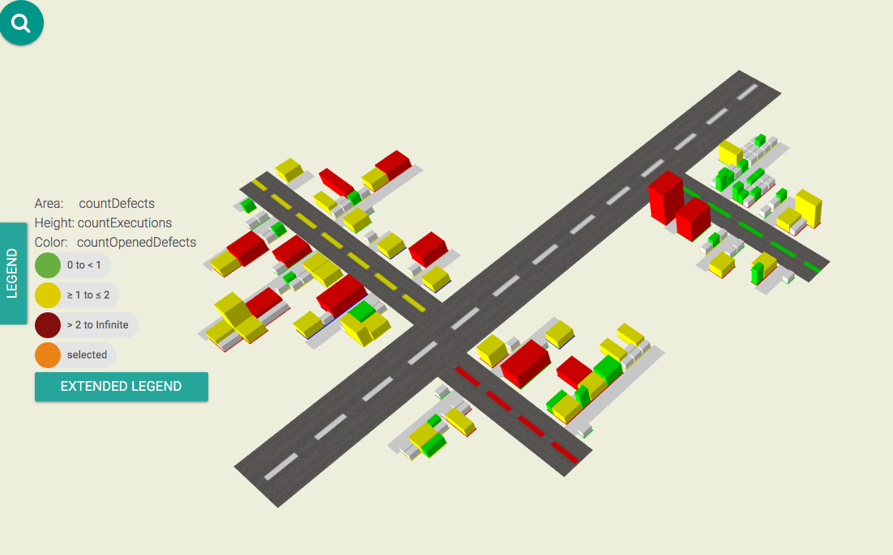

# TestVille

> MaibornWolff TestVille

#### What is TestVille?
TestVille transforms your test data into a city map, which is populated by test cases in the form of buildings of different size, shape, and color. The streets connecting the buildings represent their respective requirements

The visualization displays test metrics given in json files (visualization files) using json-schema v4.
The visualization files can be generated with the analysis module.

#### Download
You can get the latest version of `TestVille` [here](https://github.com/MaibornWolff/TestVille/releases).

#### Which file do you need?
You can visualize your with [analysis](https://github.com/MaibornWolff/TestVille/tree/master/analysis) transformed files with the online [demo](https://maibornwolff.github.io/TestVille/visualization/dist/app/) or download the whole [project](https://github.com/MaibornWolff/TestVille) and run the visualisation module on your own system.

#### Quickstart Guide
You can find the quickstart guide [here](https://maibornwolff.github.io/TestVille/).

#### Online Demo
The online demo offers the possibility to visualize your analyzed data online ([see](https://maibornwolff.github.io/TestVille/visualization/dist/app/)).

#### Feature request / Bug / Feedback
Have a bug, a feature request or any question? Please open a new issue. Feedback is always welcome.

#### License
see LICENSE.md.
