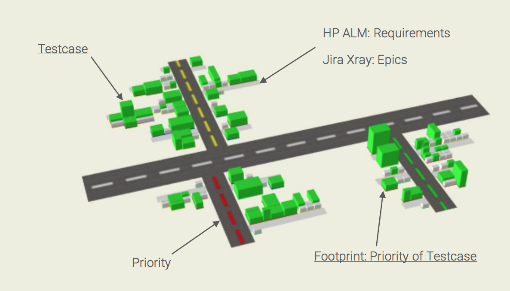
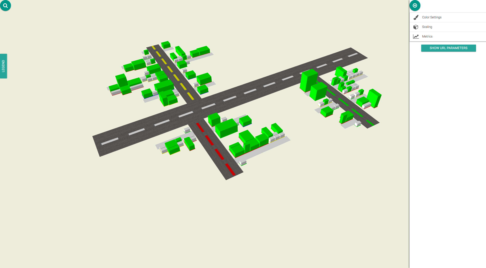

# Quicklinks

[Visualization Demo](visualization/dist/app/)

[Downloads](https://github.com/MaibornWolff/TestVille/releases)

# What is TestVille ?

Are you tired of reporting your testing state using bar charts or tables freighted with numbers counting successful test runs or coverage? These may be hard to understand or at least boring for anyone lacking full insider knowledge. This poses a challenge especially to timeboxed development in agile teams, where transparency and precision are key values.

TestVille is an open source visualization tool that addresses these needs: it allows for an intuitive understanding of your progress reporting using common indicators such as priority, number of test steps or successful test runs.

TestVille transforms your IT project data into a city map, which is populated by test cases in the form of buildings of different size, shape, and color. The streets connecting the buildings represent their respective requirements. Do you see the street with the red houses? Seems like we have a problem over there.

Anyone will be able to understand where your testing is at, even if your project contains tens of thousands of test cases. In this interactive presentation, we introduce you to the ways in which Testville makes the everyday life of a tester easier and also show you how to participate in its future development.

# Quickstart

## How to install TestVille from github

#### Requirements
* Bash or similar
* JDK 9 (Oracle OpenJDK)

#### Installation
- Download the [latest version](https://github.com/MaibornWolff/TestVille/releases/latest) of TestVille (TestVille-analysis and TestVille-visualization)
- You should now have the analysis and visualization package 
- Unpack both packages
- Enter the TestVille directory with your favorite console
- > Dos  systems: `gradlew.bat build` `&& `gradlew.bat buildProject`
- > Unix systems: `./gradlew   build` `&& `./gradlew   buildProject`

## Generate a visualization file from test data

* Export your test Project (instructions available [on](https://github.com/MaibornWolff/TestVille/tree/master/analysis/README.md))
* Run the `analysis-module` with the export file ([see](https://github.com/MaibornWolff/TestVille/tree/master/analysis/README.md)).
* CLI-Commands:
  - > Dos  systems: gradlew.bat analyse -PARGS="[options]"
  - > Unix systems: ./gradlew   analyse -PARGS="[options]"
```markdown
Options:
-xray
      Jira-Xray as data origin
-alm
      Hp-alm as data origin
-i, -inputFile
      Input file (export file)
-o, -outputFile
      Output file
-c, -config
      Configuration file for customized handling of test fields
```
 
An output file has been created.

## Visualize the analyzed test data


#### Local
* Enter the visualization directory with your favorite console
* Build the visualization module: > `[./gradlew | gradlew.bat] buildProject`
* Start a local server: > `[./gradlew | gradlew.bat] serve`
* Start your favorite browser an navigate to `dist/app
* An demo graphic has been displayed.
* You can choose the before generated file and visualize it (folder icon)

#### Online
* Open your browser and navigate to https://maibornwolff.github.io/TestVille/visualization/dist/app/
* An demo graphic has been displayed
* You can choose the before generated file and visualize it (folder icon)

Now you can see the analysis of the test data visualized in coloured streets and blocks.

Navigation:
- left click and drag -> rotate 
- right click and drag -> move the blocks
- mousewheel -> zoom in and out
Tip: If your device has a touch display, you can quickly navigate with your fingers. Use multiple fingers to drag and move the blocks. 

Change the visualized content:
- click on the second button for the settings


**Metrics:**

You can choose up to 3 metrics at once to be visualized. One defines the color of each block, one the height and one the area.
Each metric has an own value range, for Example the metric "lines of code" is the exact amount of lines in the file, that is visualized in one block. Some other metrics, like "coverage" use percantages. 

**Scaling:**

If your map is too flat to compare the blocks, or too high to even fit the window, you can scale each axis with the slider.

**Display:**

If you want to compare multiple versions of a project, use "Delta cubes". A red or green block is added on top of those blocks, that changed. This allowes you to observe changes.

**Color Settings:**

Depending on the visualized color-giving metric, you may have different accaptance values. Blocks are either coloured red, green or yellow, which is the neutral color. 
Example: Your color-metric is test-coverage, which has a range from 0 to 100 and is a percantage. 
If you want to colorize everything that has values under 20% red, and higher then 70% green, set "Neutral color start" to 20 and "Neutral color end" to 70. 
Use the "Invert Color" option, to declare a high value to be better then a low value. (A low test-coverage should be red, a low complexity should be green)

# Demo

[Visualization Demo](visualization/dist/app/)

# Further information

## Visualization

[Readme](https://github.com/MaibornWolff/TestVille/tree/master/visualization)

[Visualization Demo](visualization/dist/app/)

## Analysis

[Readme](https://github.com/MaibornWolff/TestVille/tree/master/analysis)

# Releases and Changelog

[Releases](https://github.com/MaibornWolff/TestCharta/releases)
